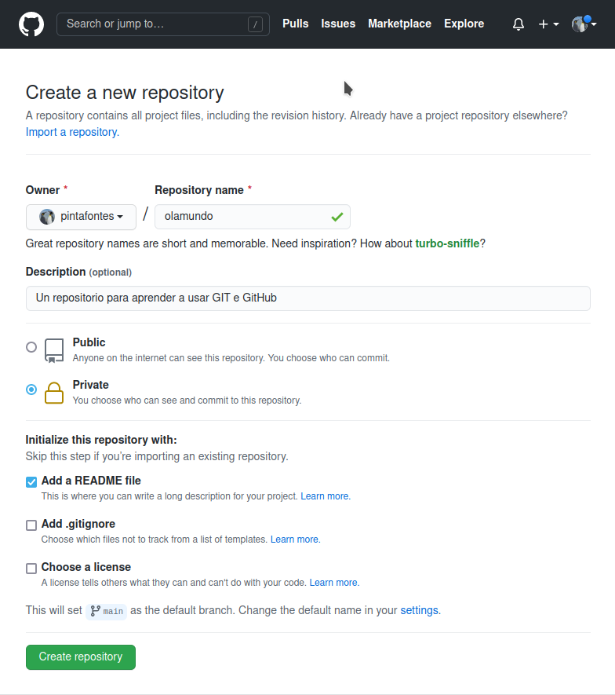

# GIT e GitHub

### Creación dun repositorio en GitHub
Imos usar Git e GitHub para crear un repositorio de arquivos, clonalos nun computador, modificalos e subir esta modificación ao repositorio principal.
1. No noso espazo en GitHub creamos un novo repositorio, que chamaremos olamundo. Engadimos unha **breve descrición**, marcámolo coma **privado** e engadimos un ficheiro inicial `readme.md`

Agora temos o noso repositorio no enderezo https://github.com/pintafontes/olamundo

2. Agora imos **clonar** este repositorio no noso computador. Aínda que pareza mentira, a mellor maneira é usando a liña de comandos

### Referencias

* [An Intro to Git and GitHub for Beginners (Tutorial)](https://product.hubspot.com/blog/git-and-github-tutorial-for-beginners)
* [GitHub guides: Hello World](https://guides.github.com/activities/hello-world/)
